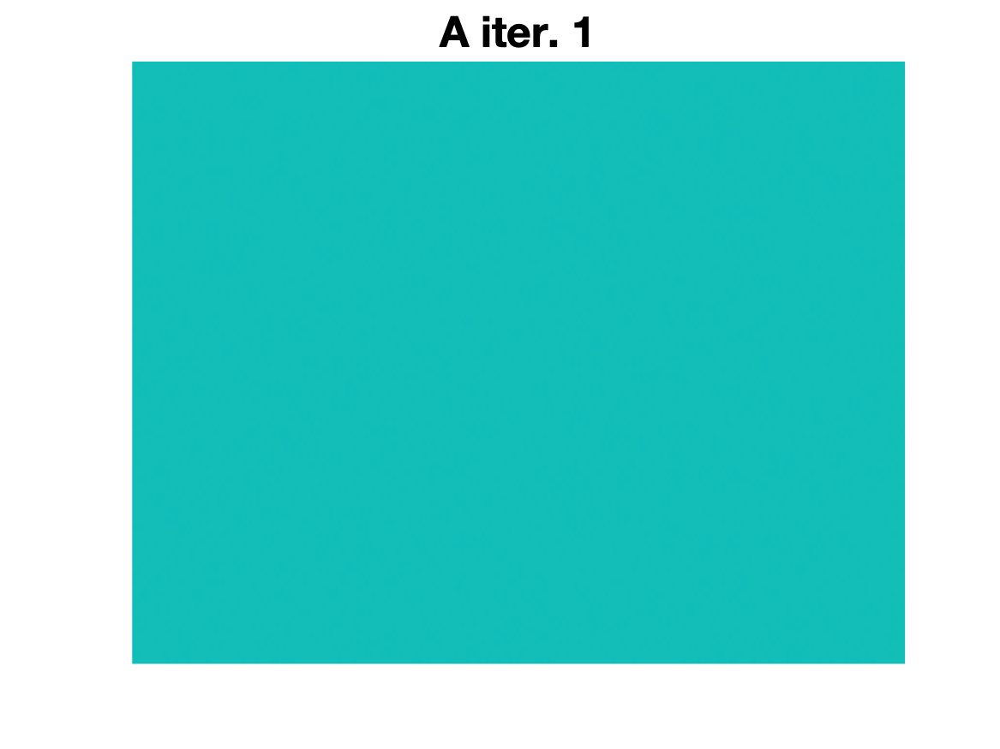
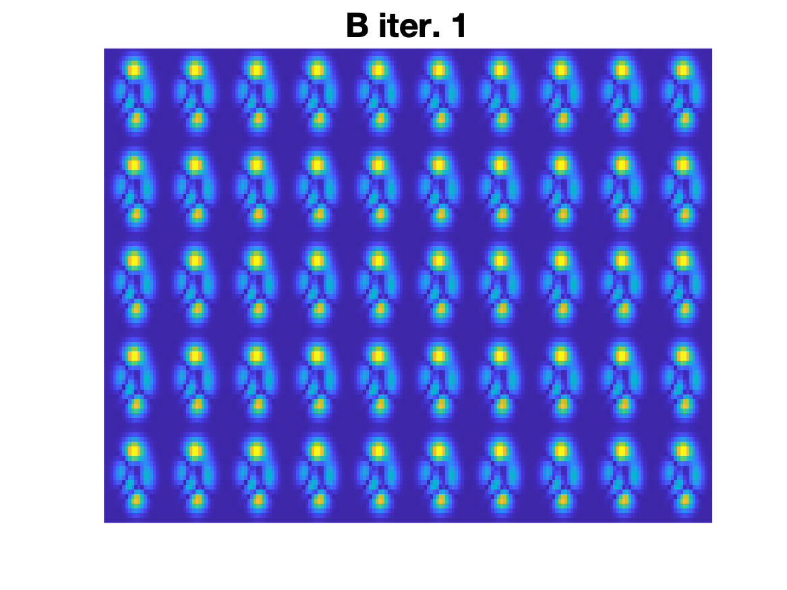

# Simple MATLAB implementation of Gerchberg-Saxton Algorithm

The Gerchberg-Saxton algorithm is an iterative phase-finding algorithm that can be used to find complex phases when one only has access to the amplitudes of an image and the amplitude of its Fourier transform. Specifically, it can find the complex phases to apply to the amplitude of a source image in order to generate a given desired target pattern when the image is Fourier transformed, despite beginning with no initial phase knowledge. One application for this is recovering phase information from a nearfield image (source) given images in the nearfield (source) and farfield (target). 

Due to redundancies in the way phase can be applied to a source image produce a given target image, the phase map produced at the end will not necessarily be the phase of the original source image; however it will be a phase map that, when applied to the source image, approximates the correct target image, such that the Fourier transform of that target image matches the source image up to some specified error. 

## Usage
This simple implementation creates a source image using MATLAB's "peaks" function and multiplying by periodic complex phase. The amplitude of the source image: 

finds the associated target image by Fourier transform,

then throws away the "secret" complex phase of the source image

 

The Gerchberg-Saxton algorithm then commences, first, finding )) $A = ifft(abs(src))$

then finding /cdot%20e^{i%20\text{arg} (A)}) $B = abs(src)/cdot e^{i arg(A)}$

then ) $C = fft(B)$

then \cdot%20e^{i%20arg(C)}) $D = abs(trg) /cdot e^{i arg(C)}$

and then taking A = ifft(D) and repeating each step, until the difference between A for the current and previous step is less than some set threshold. 

abs(A) will begin to look more and more like the source image

![]

abs(C) will begin to look more and more like the target image

![]

and the phase will converge to some phase map resembling (though not exactly matching, due to degeneracies in phase) the "secret" phase map

![].